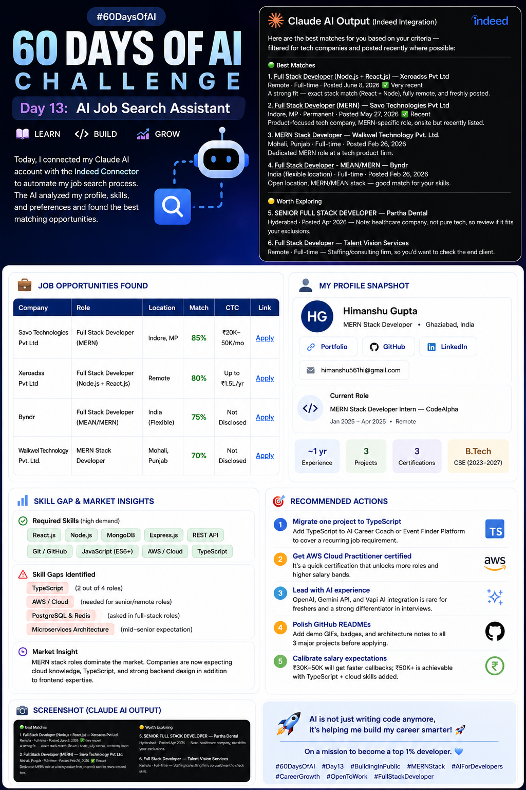

# Day 13: AI Job Search Assistant

## 🎯 Task Overview

Today, I connected my Claude AI account with the Indeed Connector to automate my job search process. By providing my professional background and search preferences, the AI analyzed the market and found matching roles.

---

## 💼 Job Opportunities Found

| Company | Role | Location | Match Score | CTC | Link |
| :--- | :--- | :--- | :---: | :--- | :--- |
| Savo Technologies Pvt Ltd | Full Stack Developer (MERN) | Indore, MP | 85% | ₹20K–50K/mo | [Apply](https://to.indeed.com/aa9kjfjnqx7z) |
| Xeroadss Pvt Ltd | Full Stack Developer (Node.js + React.js) | Remote | 80% | Up to ₹1.5L/yr | [Apply](https://to.indeed.com/aayvmdqrstp9) |
| Byndr | Full Stack Developer (MEAN/MERN) | India (Flexible) | 75% | Not Disclosed | [Apply](https://to.indeed.com/aadxt42jv9d9) |
| Walkwel Technology Pvt. Ltd. | MERN Stack Developer | Mohali, Punjab | 70% | Not Disclosed | [Apply](https://to.indeed.com/aa2rcgv6gygc) |

---

## 📊 Skill Gap & Market Insights

### Required Skills

* React.js & Node.js (demanded in all 4 roles)
* MongoDB & Express.js
* REST API Development
* Git / GitHub
* JavaScript (ES6+)
* AWS / Cloud (emerging requirement)
* TypeScript (mentioned in 2/4 roles)

### Skill Gaps

* TypeScript — needed in 2 out of 4 roles
* AWS / Cloud basics — required for senior/remote positions
* PostgreSQL & Redis — asked in full-stack roles
* Microservices architecture — expected at mid-senior level

### Recommendations

1. **Migrate one project to TypeScript** — Add TypeScript to AI Career Coach or Event Finder Platform to cover a recurring job requirement.
2. **Get AWS Cloud Practitioner certified** — It's a quick certification that unlocks more roles and higher salary bands.
3. **Lead with AI experience** — OpenAI, Gemini API, and Vapi AI integration is rare for freshers and a strong differentiator in interviews.
4. **Polish GitHub READMEs** — Add demo GIFs, badges, and architecture notes to all 3 major projects before applying.
5. **Calibrate salary expectations** — ₹30K–50K will get faster callbacks; ₹50K+ is achievable with TypeScript + cloud skills added.

---

## 📸 Screenshots

