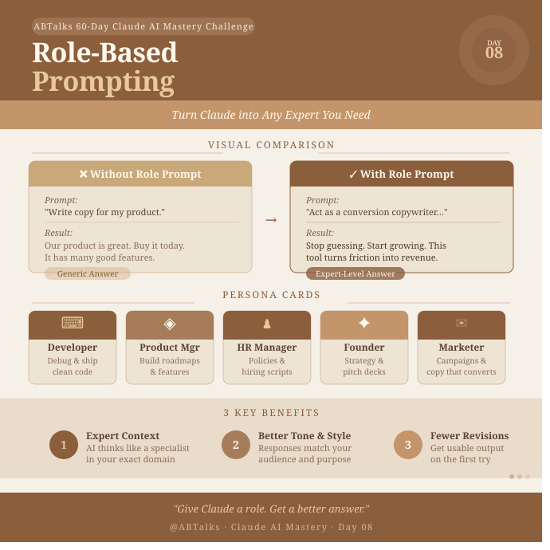

# Day 3: Role-Based Prompting — ABTalks 60-Day Claude AI Mastery Challenge

## 🎯 Objective

To understand how assigning a specific persona (role, background, and constraints) to Claude alters its perspective, tone, and depth, shifting its outputs from generic answers to expert-level insights.

---

## 🧪 The Experiment

**Core Query Tested:** _"How should we market a new productivity app?"_

### 1. Baseline Output (Without Assigning a Role)

- **Prompt:** _"How should we market a new productivity app?"_
- **Output Style:** Generic, high-level marketing advice.
- **Key Points Mentioned:** \* Create a social media presence.
  - Run paid advertisements.
  - Launch an email marketing newsletter.
  - Optimize for App Store SEO (ASO).
- **Observation:** The response was accurate but lacked depth, actionable strategies, or a specific business lens.

### 2. Persona 1: Tech Startup Founder

- **Prompt:** _"You are an experienced tech startup founder who has successfully launched and scaled multiple SaaS products on a tight budget. How should we market a new productivity app?"_
- **Output Style:** Strategic, growth-focused, risk-aware, and budget-conscious.
- **Key Points Mentioned:**
  - Launch on Product Hunt and Hacker News to build early organic traction.
  - Build a tight feedback loop with initial power users (Beta testing).
  - Implement viral loops and referral programs inside the app mechanics.
  - Focus heavily on organic growth hacking over expensive paid ads to preserve runway.

### 3. Persona 2: Senior Full-Stack Developer

- **Prompt:** _"You are a senior full-stack software engineer and open-source contributor who values clean code, performance, and developer tooling. How should we market a new productivity app?"_
- **Output Style:** Technical, community-driven, and utility-oriented.
- **Key Points Mentioned:**
  - Market through technical transparency (e.g., "Build in Public" on Twitter/X).
  - Share the technical stack architecture (e.g., optimizing performance, layout rendering).
  - Engage with developer communities on Reddit, Discord, and GitHub.
  - Highlight end-to-end encryption, speed/load times, and keyboard-shortcut features as major selling points.

---

## 📊 Comparison & Key Learnings

| Metric              | Without Role          | As a Founder               | As a Developer                     |
| :------------------ | :-------------------- | :------------------------- | :--------------------------------- |
| **Tone**            | Informative / Generic | Strategic / Actionable     | Technical / Analytical             |
| **Focus Area**      | General Marketing     | ROI, Traction, Runway      | Performance, Community, Tech Stack |
| **Target Audience** | General Public        | Investors & Early Adopters | Developers & Power Users           |

### Key Takeaways:

1. **Context is King:** Claude adapts its vocabulary and constraints based on the persona assigned.
2. **Domain Expertise:** Role-prompting forces the AI to narrow its data retrieval to relevant professional frameworks.
3. **Multi-Perspective Problem Solving:** You can simulate a whole team meeting (Founder, PM, Dev) just by altering the role prompts on the same problem statement.

---

## 🛠️ Tool of the Day: Claude Usage Counter

- **Installation:** Successfully added the [Claude Usage Counter](https://www.abtalks.in/challenge/3?challenge=cmpwmw1sa000bld046coev629) extension to Chrome.
- **Utility:** It allows me to track real-time token counts, message consumption, and remaining quota directly inside the `Claude.ai` interface. This is highly useful for managing usage limits during long development sessions.

---

## 📸 Screenshots

_Below is the experiment output screenshot saved in this folder:_

