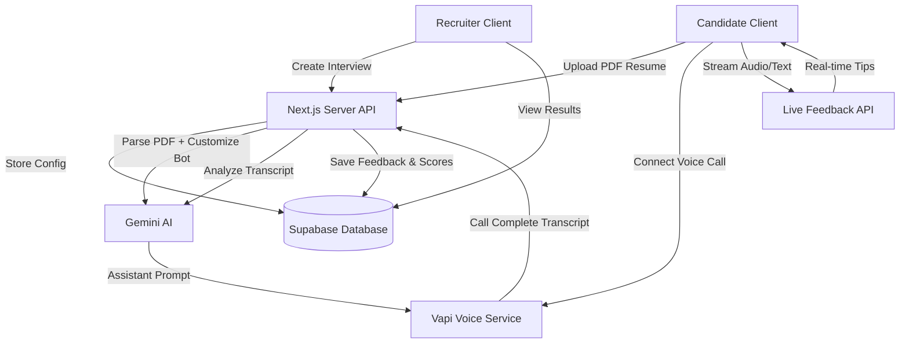

# Product Requirements Document (PRD)

## Project: AI-Powered Interview Taker & Feedback System
*Empowering Career Journeys through Conversational Voice AI*

---

## 1. Executive Summary & Problem Statement

### 1.1 The Problem
In the modern hiring landscape, traditional resume screening fails to evaluate communication skills, soft skills, and practical problem-solving capabilities in a scalable way. For candidates, preparing for live interviews is nerve-wracking, and quality mock interviews are hard to schedule. For recruiters, conducting initial phone screenings is time-consuming, repetitive, and inconsistent.

### 1.2 The Solution
The **AI-Powered Interview Taker & Feedback System** bridges this gap by offering automated, high-fidelity, real-time voice interviews. 
- **Recruiters** can create custom interview templates by uploading job requirements, generating public shareable interview links, and reviewing candidates' performances from an organized dashboard.
- **Candidates** click a link, upload their resume, and engage in a real-time verbal dialogue with an AI interviewer tailored to their background and target job description. The candidate receives live speech coaching, and the recruiter gets a detailed, structured feedback report.

---

## 2. Target Audience & Personas

### 2.1 Recruiter (B2B User)
* **Goal**: Screen 100+ candidates for soft skills, technical alignment, and communication quality without spending hours on scheduling and phone calls.
* **Needs**: Simple dashboard to create interview templates, share links easily, and review structured candidate scores and full transcripts side-by-side.

### 2.2 Candidate/Job Seeker (B2C User)
* **Goal**: Take a realistic, stress-free mock interview or complete an initial screening that respects their background.
* **Needs**: Responsive, browser-based voice interface with instant guidance/tips, clear visual feedback, and a fair evaluation.

---

## 3. Product Scope & Functional Requirements

### 3.1 Recruiter Features
1. **Google Auth Authentication**: Streamlined login using Google. Only authenticated recruiters can create and manage interview links.
2. **Interview Dashboard**: A dashboard showing all scheduled/created interviews, active links, and candidate response counts.
3. **Interview Creation Wizard**: A form where recruiters define the Job Role and paste the Job Description to configure the AI agent.
4. **Candidate Submissions & Details**: A detailed view for each interview listing all candidates who took it, their scores, full transcripts, and Gemini-generated feedback.

### 3.2 Candidate Features
1. **Public Intake Page**: Clean, public page (`/interview/[interview_Id]`) where the candidate inputs their Name, Email, and uploads a PDF Resume.
2. **Real-time Voice Interview**: A conversational voice call powered by the **Vapi Web SDK**, limited to **5 questions or 7 minutes**.
3. **Live Transcript Panel**: Real-time display of spoken candidate and AI interviewer speech using Vapi's streamed transcripts.
4. **Live Mentor Tips**: A sliding panel showing instant suggestions (e.g., "Good answer, try to mention metrics," "Speaking pace is a bit fast") based on real-time text analysis.
5. **Immediate Completion Feedback**: Optional candidate feedback overview showing how they did upon ending the call.

---

## 4. Technical Architecture & Data Flow

### 4.1 Technology Stack
* **Framework**: Next.js 15 (React 19, Tailwind CSS v4, shadcn/ui)
* **Database & Auth**: Supabase (Postgres & Supabase Auth)
* **Voice Engine**: Vapi (Vapi Web SDK for browser calling)
* **LLM Engine**: Gemini AI (for resume parsing, feedback reports, and live suggestions) & OpenAI/OpenRouter (optional fallback)
* **Deployment**: Netlify

---

## 5. Database Schema (Supabase)

### 5.1 Table: `profiles`
Stores recruiter user profile information synchronized with Supabase auth users.
* `id`: UUID (Primary Key, references `auth.users.id`)
* `email`: Text
* `full_name`: Text
* `created_at`: Timestamp

### 5.2 Table: `interviews`
Created by recruiters to define specific job openings.
* `id`: UUID (Primary Key)
* `recruiter_id`: UUID (References `profiles.id`)
* `job_role`: Text
* `job_description`: Text
* `created_at`: Timestamp

### 5.3 Table: `candidate_submissions`
Created when a candidate completes an interview call.
* `id`: UUID (Primary Key)
* `interview_id`: UUID (References `interviews.id`)
* `candidate_name`: Text
* `candidate_email`: Text
* `resume_text`: Text
* `vapi_call_id`: Text (To link the call recording/transcript)
* `overall_score`: Integer (1-100)
* `strengths`: Text (JSON or bulleted string)
* `weaknesses`: Text (JSON or bulleted string)
* `suggestions`: Text
* `transcript`: Text (JSON array of dialogue)
* `completed_at`: Timestamp

---

## 6. Detailed User Flows

### 6.1 Recruiter Flow
1. Recruiter logs in via **Google Auth** -> redirected to Dashboard.
2. Clicks "Create Interview" -> fills out Job Role ("Frontend Engineer") and Job Description -> submits.
3. System saves the entry and gives the recruiter a shareable link: `https://yourdomain.com/interview/[interview_Id]`.
4. Recruiter shares the link. Later, recruiter clicks "View Details" to see the list of candidates, overall metrics, and feedback.

### 6.2 Candidate Flow
1. Candidate visits `/interview/[interview_Id]`.
2. Fills in Name, Email, and uploads a Resume (PDF).
3. System parses the PDF and uses Gemini to build a customized, resume-aware system prompt for the Vapi Agent.
4. Candidate clicks "Start Voice Interview" -> Call opens.
5. Vapi Assistant greets the candidate and begins testing.
6. Candidate speaks. A live transcript scrolls on screen, and an "AI Tips" box updates dynamically with tips.
7. Call auto-terminates after 5 questions or 7 minutes (or the user hangs up).
8. Candidate is shown a "Thank you" screen. Under the hood, the call transcript is sent to Gemini to generate feedback and update Supabase.

---

## 7. Out of Scope for v1.0 (Future Enhancements)
* Video recording or facial emotion analysis.
* Custom recruiter email invitations or scheduling calendars.
* Multi-language support (English only in v1.0).
* Stripe billing and limits on recruiters.
