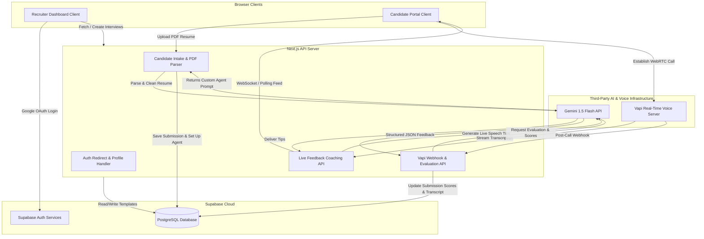

# System Architecture & Tech Stack

This document specifies the technical architecture and the finalized technological stack for the **AI-Powered Interview Taker & Feedback System**.

---

## 1. Tech Stack Selection & Justification

To build a high-performance, responsive voice application within 10 days while keeping costs at zero (using free tiers), the following stack has been selected:

| Layer | Technology | Justification |
| :--- | :--- | :--- |
| **Frontend** | **Next.js 15 (React 19, Tailwind CSS v4, shadcn/ui)** | Next.js 15 App Router offers superb file-based routing, server components, and serverless API handlers in a single repository. Tailwind CSS v4 ensures fast utility-based styling with modern CSS variables, and shadcn/ui provides clean, customizable interactive primitives. |
| **Backend** | **Next.js API Route Handlers** | Eliminates the overhead of maintaining a separate backend. Handles resume uploads, call completions, Webhooks from Vapi, and communications with Gemini. |
| **Database** | **Supabase PostgreSQL** | Relational SQL database perfect for structured recruiter profiles, candidate submissions, and interview configs. Comes with built-in pgvector support if needed later and excellent client libraries. |
| **Authentication** | **Supabase Auth (Google Provider)** | Simple, industry-standard authentication. Google login handles security, session tokens, and automatic user profile tracking via DB triggers. |
| **Voice Engine** | **Vapi (Web SDK & Voice AI)** | The core engine. Vapi handles WebRTC browser-to-server audio streaming, noise reduction, and integration with Speech-To-Text (Deepgram) and Text-To-Speech (Cartesia/11Labs). It drastically reduces latency and complexity compared to building WebRTC pipelines manually. |
| **AI Model / API** | **Gemini 1.5 Flash** | Used for resume text parsing, dynamic Vapi system prompt construction (customizing interviewer behavior based on candidate profile + JD), live speech coaching tips, and post-call feedback reports. Flash is chosen for its near-instant latency, massive context window (1M tokens), and highly cost-effective free tier. |
| **Hosting** | **Netlify** | Fast, free deployment for Next.js applications. Automatically compiles Next.js API route handlers into serverless functions and offers direct GitHub CI/CD integration. |
| **Libraries** | `@supabase/supabase-js`, `@vapi-ai/web`, `sonner`, `lucide-react`, `pdf-parse` | Small-footprint developer packages to handle state synchronization, WebRTC calls, toasts, icons, and server-side PDF reading. |

---

## 2. Component Diagram

The following diagram illustrates how the system's client-side, server-side, database, and third-party API components interact with each other:



---

## 3. Detailed Data Flow & Request Lifecycle

### Phase A: Interview Template Configuration (Recruiter)
1. Recruiter signs in using Google OAuth through Supabase Auth.
2. Recruiter provides **Job Title** and **Job Description** inside the dashboard.
3. Client issues a `POST` request to `/api/interviews` which inserts a new record in the `interviews` table.
4. The database returns the unique `interview_id`.
5. The Recruiter is shown a public link: `https://domain.com/interview/[interview_id]`.

### Phase B: Candidate Intake & Dynamic Agent Configuration (Candidate)
1. Candidate navigates to the public link `https://domain.com/interview/[interview_id]`.
2. Candidate inputs **Name**, **Email**, and uploads a **Resume (PDF)**.
3. Candidate clicks "Next". The browser sends the form data and file payload to `/api/ai-model`.
4. The server parses the PDF text.
5. The server calls the **Gemini 1.5 Flash API**, passing the parsed resume text and the job description retrieved from the `interviews` table.
6. **Gemini** generates:
   - A highly personalized system prompt for the Vapi Agent (e.g. *"You are interviewing [Name] for [Role]. Their background includes [Company/Project]. Ask them about [Topic X]. Start with a warm greeting. Keep your answers brief."*).
   - A unique pool of questions tailored to the candidate's experience.
7. Next.js server creates a new pending record in the `candidate_submissions` table containing the user profile, resume text, and temporary credentials, then returns the Vapi Agent configuration to the browser client.

### Phase C: The Voice Call & Real-time AI Mentorship (Candidate)
1. The candidate clicks "Start Voice Interview".
2. The Candidate Client instantiates `@vapi-ai/web` and initializes the call with the dynamic agent prompt.
3. The candidate speaks. The Vapi agent responds back verbally (latency < 1s).
4. **Vapi Web SDK** triggers local browser event listeners when a speech snippet is completed.
5. Client captures the latest completed candidate response and sends it to `/api/ai-feedback`.
6. `/api/ai-feedback` hits **Gemini** asynchronously: *"Analyze this answer for communication tips: [Candidate speech]. Job description is: [JD]. Tell them in 1 sentence how to improve or validate."*
7. Gemini returns the feedback tip, which appears dynamically on the candidate's sliding "AI Tips" sidebar.

### Phase D: Call Finalization & Comprehensive Evaluation (System)
1. The call ends when:
   - The candidate hangs up.
   - The timer reaches 7 minutes.
   - The assistant completes the 5 questions and says goodbye.
2. Vapi servers trigger a `POST` webhook to `/api/vapi-webhook` with the finalized call log, including:
   - The `vapi_call_id`.
   - The full speaker-annotated transcript array.
3. `/api/vapi-webhook` takes the entire transcript and job description, then prompts **Gemini 1.5 Flash** using a structured JSON schema:
   - **JSON Format**:
     ```json
     {
       "overall_score": 85,
       "strengths": ["Clear explanation of technical concepts", "Good structure using STAR method"],
       "weaknesses": ["Spoke slightly too fast under pressure", "Could specify metrics for past projects"],
       "suggestions": "Practice breathing exercises before interviews and slow down your pacing."
     }
     ```
4. Next.js server updates the candidate's record in `candidate_submissions` with the calculated score, JSON strengths, weaknesses, suggestions, and full transcript.
5. Candidate is redirected to `/interview/[interview_id]/completed`.
6. Recruiter is notified (via real-time database listener, or Dashboard refreshes) and sees the submission in their candidate management panel.

---

## 4. AI Interaction Model & Latency Optimization

To achieve a seamless user experience, we handle the LLM calls differently depending on the context:

* **Voice Conversation (Synchronous Vapi-to-User)**: High latency is a conversation killer. We delegate real-time speech synthesis and conversational intelligence directly to **Vapi**, which handles system instructions using low-latency model piping (using pre-warmed engines). This keeps audio turnaround under 800ms.
* **Live Mentorship (Asynchronous Client-to-Gemini)**: Handled out-of-band. The candidate talks, and text is transcribed. The prompt is sent to `/api/ai-feedback` without blocking the audio channel. The tips appear in the browser panel as they arrive, preserving the natural flow of the conversation.
* **Post-Call Analysis (Server-to-Gemini)**: Since the call has ended, the candidate is in a waiting state or has closed the tab. Latency is less critical here (2-3 seconds is perfectly acceptable). This allows us to use a thorough prompt with strict JSON schemas to get a highly detailed review.

---

## 5. Security & Isolation Model

* **Authentication**: Supabase Auth handles JSON Web Tokens (JWT). All recruiter dashboard routes (`/dashboard/*`, `/scheduled-interview/*`) verify this token server-side or redirect to `/auth` on access attempts.
* **Row-Level Security (RLS)**:
  - Database tables utilize PostgreSQL security policies.
  - A recruiter can only view templates and candidate data that link back to their authenticated `recruiter_id`.
  - Public routes (`/interview/[interview_id]`) only have read access to the specific interview configuration (Job Role/Job Description) and write-only access to create a single submission record.
