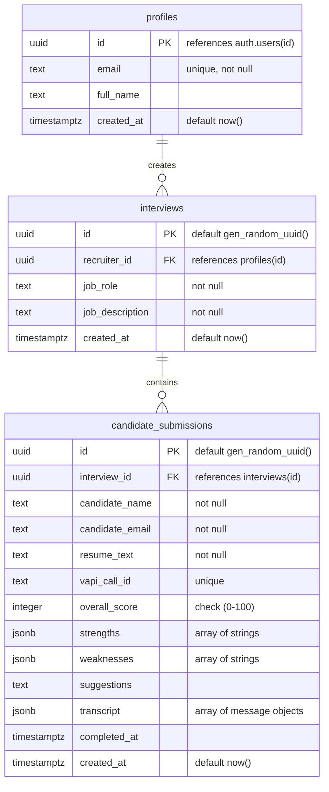

# Database Schema Design

This document details the database schema, data types, constraints, and Row Level Security (RLS) policies implemented in Supabase (PostgreSQL) for the **AI-Powered Interview Taker & Feedback System**.

---

## 1. Relational Schema Diagram



---

## 2. Table SQL DDL Definitions

### 2.1 Table: `profiles`
Stores profile records synchronized with Supabase's internal auth module.
```sql
CREATE TABLE public.profiles (
    id UUID PRIMARY KEY REFERENCES auth.users(id) ON DELETE CASCADE,
    email TEXT NOT NULL UNIQUE,
    full_name TEXT,
    created_at TIMESTAMPTZ DEFAULT TIMEZONE('utc'::text, NOW()) NOT NULL
);
```

### 2.2 Table: `interviews`
Created by recruiters to configure jobs and generate public candidate call templates.
```sql
CREATE TABLE public.interviews (
    id UUID PRIMARY KEY DEFAULT gen_random_uuid(),
    recruiter_id UUID NOT NULL REFERENCES public.profiles(id) ON DELETE CASCADE,
    job_role TEXT NOT NULL CHECK (CHAR_LENGTH(job_role) > 0),
    job_description TEXT NOT NULL CHECK (CHAR_LENGTH(job_description) > 0),
    created_at TIMESTAMPTZ DEFAULT TIMEZONE('utc'::text, NOW()) NOT NULL
);

-- Index for fast lookup of recruiter interviews
CREATE INDEX idx_interviews_recruiter ON public.interviews(recruiter_id);
```

### 2.3 Table: `candidate_submissions`
Contains the candidate data, their resume text, Vapi calling parameters, transcripts, and Gemini-generated scores.
```sql
CREATE TABLE public.candidate_submissions (
    id UUID PRIMARY KEY DEFAULT gen_random_uuid(),
    interview_id UUID NOT NULL REFERENCES public.interviews(id) ON DELETE CASCADE,
    candidate_name TEXT NOT NULL CHECK (CHAR_LENGTH(candidate_name) > 0),
    candidate_email TEXT NOT NULL CHECK (CHAR_LENGTH(candidate_email) > 0),
    resume_text TEXT NOT NULL,
    vapi_call_id TEXT UNIQUE,
    overall_score INTEGER CHECK (overall_score >= 0 AND overall_score <= 100),
    strengths JSONB DEFAULT '[]'::jsonb NOT NULL,
    weaknesses JSONB DEFAULT '[]'::jsonb NOT NULL,
    suggestions TEXT,
    transcript JSONB DEFAULT '[]'::jsonb NOT NULL,
    completed_at TIMESTAMPTZ,
    created_at TIMESTAMPTZ DEFAULT TIMEZONE('utc'::text, NOW()) NOT NULL
);

-- Index for fetching all candidate results for a given interview
CREATE INDEX idx_submissions_interview ON public.candidate_submissions(interview_id);
```

---

## 3. Database Automation (Profile Creation Sync)

A PostgreSQL trigger is created to automatically create a profile row in the `profiles` table whenever a recruiter registers a new account via Google OAuth.

```sql
-- Create profile sync function
CREATE OR REPLACE FUNCTION public.handle_new_user()
RETURNS TRIGGER AS $$
BEGIN
    INSERT INTO public.profiles (id, email, full_name)
    VALUES (
        new.id,
        new.email,
        COALESCE(new.raw_user_meta_data->>'full_name', new.raw_user_meta_data->>'name', 'Recruiter')
    )
    ON CONFLICT (id) DO NOTHING;
    RETURN NEW;
END;
$$ LANGUAGE plpgsql SECURITY DEFINER;

-- Bind trigger to auth.users table
CREATE OR REPLACE TRIGGER on_auth_user_created
    AFTER INSERT ON auth.users
    FOR EACH ROW EXECUTE FUNCTION public.handle_new_user();
```

---

## 4. Security & Row-Level Security (RLS) Policies

Row-Level Security (RLS) is activated on all tables. Supabase Client queries are authenticated automatically using JWT tokens injected by the Next.js wrapper.

```sql
-- Enable RLS
ALTER TABLE public.profiles ENABLE ROW LEVEL SECURITY;
ALTER TABLE public.interviews ENABLE ROW LEVEL SECURITY;
ALTER TABLE public.candidate_submissions ENABLE ROW LEVEL SECURITY;
```

### 4.1 Policies for `profiles`
* **Read Profiles**: Recruiter can read their own profile row.
  ```sql
  CREATE POLICY "Allow recruiters to view own profile"
  ON public.profiles FOR SELECT
  USING (auth.uid() = id);
  ```
* **Update Profiles**: Recruiter can update their own profile details.
  ```sql
  CREATE POLICY "Allow recruiters to edit own profile"
  ON public.profiles FOR UPDATE
  USING (auth.uid() = id);
  ```

### 4.2 Policies for `interviews`
* **Read Interviews**: Anyone (including candidates) can view the interview template configuration to load the Job Role and Job Description.
  ```sql
  CREATE POLICY "Allow public read access to interviews"
  ON public.interviews FOR SELECT
  USING (true);
  ```
* **Manage Interviews**: Only the creating recruiter can insert, update, or delete interview configurations.
  ```sql
  CREATE POLICY "Allow owners to manage interviews"
  ON public.interviews FOR ALL
  USING (auth.uid() = recruiter_id);
  ```

### 4.3 Policies for `candidate_submissions`
* **Insert Submissions**: Public/Anonymous client (candidate filling form) can write a submission row.
  ```sql
  CREATE POLICY "Allow public to submit candidate registration"
  ON public.candidate_submissions FOR INSERT
  WITH CHECK (true);
  ```
* **View Submissions**: Only the recruiter who created the parent interview template can view the candidates' submissions.
  ```sql
  CREATE POLICY "Allow recruiters to view submissions under their interviews"
  ON public.candidate_submissions FOR SELECT
  USING (
      EXISTS (
          SELECT 1 FROM public.interviews
          WHERE public.interviews.id = public.candidate_submissions.interview_id
          AND public.interviews.recruiter_id = auth.uid()
      )
  );
  ```
* **Update Submissions (Webhook Updates)**: Post-call evaluation reports are updated by the Next.js API serverless route handlers. Since serverless APIs execute in a secure back-end context, they will bypass RLS check entirely by utilizing the Supabase **Service Role Key** (admin access). Therefore, no public update policy is required, keeping candidate records immutable from client-side manipulation.

---

## 5. Schema Validation Against PRD User Stories

Let's validate this schema against every core user flow defined in the PRD:

* **Story 1: Recruiter Google OAuth Sign-in & Profile Initialization**
  * *Validation*: Handled. The `profiles` table stores the synced ID. The trigger `on_auth_user_created` guarantees that when a recruiter logs in for the first time via Supabase Auth, they are provisioned a record immediately.
* **Story 2: Recruiter Creates Interview Template**
  * *Validation*: Handled. The `interviews` table requires `recruiter_id` which references `profiles.id` (auth user). Check constraints verify that roles and descriptions cannot be empty.
* **Story 3: Candidate Intake (Onboarding)**
  * *Validation*: Handled. The candidate lands on `/interview/[interview_Id]`. RLS allows the browser client to fetch the interview details (`job_role`, `job_description`). When registering, the client inserts candidate records (`candidate_name`, `candidate_email`, `resume_text`) into `candidate_submissions` with the associated `interview_id`. The insert policy makes this possible without authentication.
* **Story 4: Real-time Audio Call & Live Mentorship**
  * *Validation*: Handled. The `candidate_submissions` row acts as the placeholder, and can hold a `vapi_call_id` to link the session. Text snippets and recommendations are processed statelessly in-memory, keeping database load minimal.
* **Story 5: Call Completed Evaluation Logging**
  * *Validation*: Handled. The `candidate_submissions` table contains fields for `overall_score`, `strengths` (JSONB array), `weaknesses` (JSONB array), `suggestions` (TEXT), and `transcript` (JSONB conversation logs). Next.js server bypasses client RLS using the admin client, updating these rows when the Vapi webhook completes.
* **Story 6: Recruiter Candidate Management Dashboard**
  * *Validation*: Handled. The recruiter loads the page. Next.js fetches `candidate_submissions` filtered by the target `interview_id`. The RLS policy validates that the authenticated `auth.uid()` matches the owner of that `interview_id`, preventing unauthorized access to other recruiter's pipelines.
