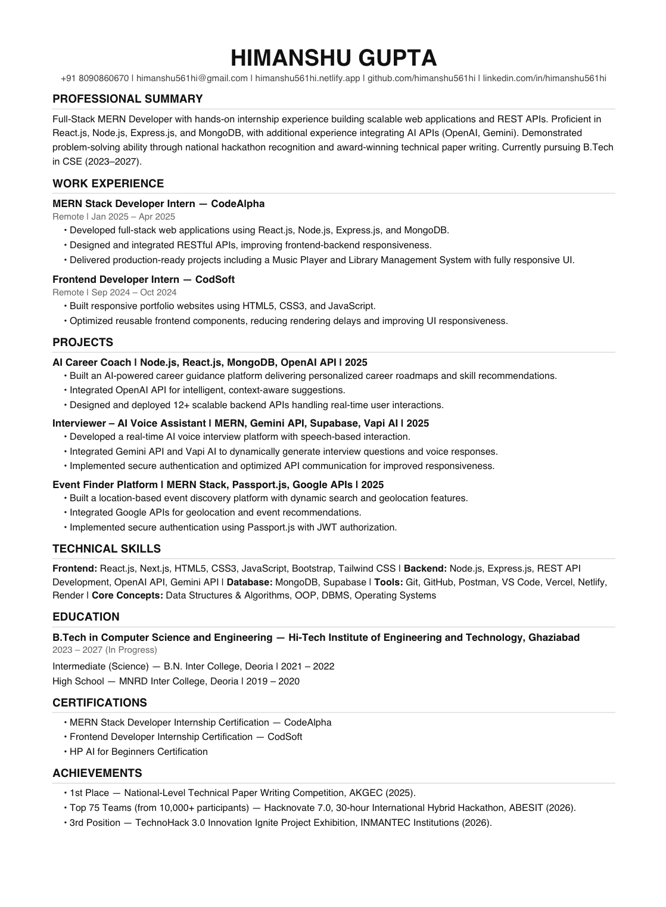

# Day 6: AI Resume Optimizer

## Task Overview

Today's challenge focused on transforming a standard resume into an ATS-optimized and recruiter-friendly document using Claude. The goal was to align keywords, structure achievements effectively, and ensure clean formatting.

---

## Original Resume vs. Optimized Resume

### Original Resume

- Add your previous resume text or description here.
- Example: [Briefly mention what your old resume looked like]

### Optimized Resume

- Paste the final single-column, A4 format resume text generated by Claude here.
- Make sure it includes sections like: Professional Summary, Education, Experience, Projects, Skills, and Certifications.

---

## Screenshot

---

## Key Learnings

1. **ATS Compatibility:** Learned that simple single-column formatting without tables, text boxes, or icons is crucial for Applicant Tracking Systems to parse data correctly.
2. **Action Verbs & Impact:** Understood how using strong action verbs and structuring points clearly enhances recruiter readability.
3. **Keyword Alignment:** Realized the importance of matching core technical and soft skills cleanly to field requirements without fabricating information.
