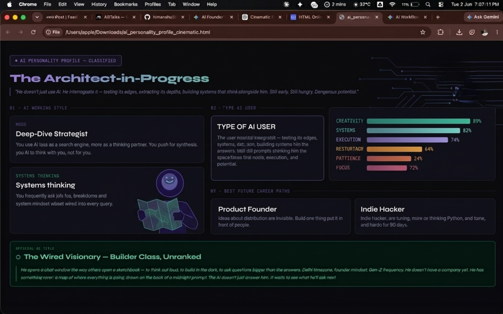
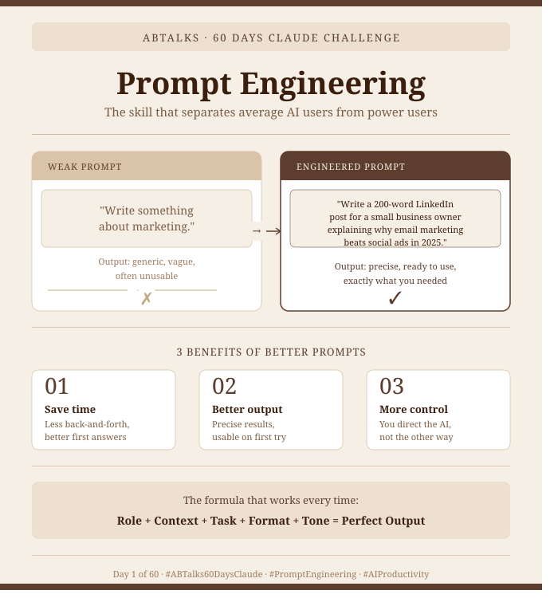

# 🚀 60 Days of AI Challenge

Welcome to my documentation repository for the **ABTalks 60 Days of AI Challenge**. Over the next 60 days, I am shifting from a casual AI user to building a highly optimized, professional AI-driven workflow. I will be tracking my daily progress, prompts, experiments, and takeaways right here.

---

## 🛠️ Day 1: System Architecture & AI Personality Profile

### 📌 Core Objectives

- **Workflow Optimization:** Transitioned from scattered browser tabs to a dedicated, localized workspace using the **Claude Desktop App**.
- **Context-Driven Prompting:** Created a deep-dive master context workspace within Claude Projects to structure all future developer interactions.
- **Building in Public:** Initialized this public repository to establish a continuous, verifiable "proof of work" portfolio.

### 🧠 My AI Personality Profile: The Wired Visionary

On Day 1, I executed a cinematic profile analysis based on my technical usage patterns, engineering goals, and decision-making style. The breakdown revealed my core developer persona:

- **Profile Archetype:** The Visionary Tinkerer / The Architect-in-Progress
- **Working Style:** **Deep-Dive Strategist** — Utilizing LLMs as an analytical thinking partner for synthesis and systems-level architecture rather than a simple syntax search engine.
- **Official Classification:** _The Wired Visionary — Builder Class, Unranked_

#### 📊 System Metrics

- 🟢 **Creativity:** 89%
- 🔵 **Systems Thinking:** 82%
- 🟣 **Execution Rate:** 74%
- 🟠 **Patience w/ Process:** 24%

### 📸 Proof of Work (Day 1)

---

## 🧠 Day 2: Prompt Engineering & Structural UI Layouts

### 📌 Core Objectives

- **Semantic Prompt Optimization:** Learned how transforming a vague user intent into an explicitly constrained structural request dramatically upgrades LLM output quality.
- **UI Blueprinting via Text:** Instructed the LLM to structure technical documentation on **Flutter** using advanced UI paradigms (Component Grid Cards, Pill Badges, and Visual Hierarchy Process Lists).
- **Reducing Interaction Cycles:** Mitigated prompt sprawl by achieving complex, highly readable documentation formatting in a single, well-architected turn.

### 📊 The Experiment: Weak vs. Engineered Prompting

To analyze the power of prompt design, I tested two approaches using a "Flutter for Beginners" guide as our test case:

#### ❌ Approach A: The Lazy Prompt (Weak)

> _"Please write a concise, informative article about Flutter for beginners. Include overview, key features, setup steps, a simple code sample, and platform support..."_

- **The Outcome:** The AI returned raw, unformatted walls of text. It used monotone standard markdown code blocks, messy standard lists, and zero visual breaks. Hard to read and lacked structural authority.

#### Approach B: The Engineered Prompt (Optimized)

> Provided rigorous context defining a frontend design masterclass persona, strict rules for structural layout grids, mandatory emerald-tinted callout banners, and clean badge layouts for cross-platform components.

- **The Outcome:** A production-grade frontend documentation site layout. It organized technical pillars (Flutter, Dart, Skia) into structural modules, designed clean pill badges for OS compatibility (`Android`, `iOS`, `Web`), and built an interactive step-by-step setup onboarding tracker.

### 🛠️ Key Technical Takeaways

1. **Structural Constraints Over Empty Directives:** Simply asking an AI to "be creative" fails. Providing explicit container constraints (e.g., _"represent compatibility states as independent pill rows"_) enforces elite output.
2. **Context Anchoring:** Setting up explicit system behaviors prevents the model from dropping essential technical details (like Dart's JIT/AOT compilation modes) while trying to remain beginner-friendly.

### 📸 Proof of Work (Day 2)

Here is the visual transition showing the plain markdown generation evolving into a highly structured frontend documentation layout:

_Comparison of Output Structure:_

---

_Follow along as I document the evolution of my developer workflow over the next 60 days._
