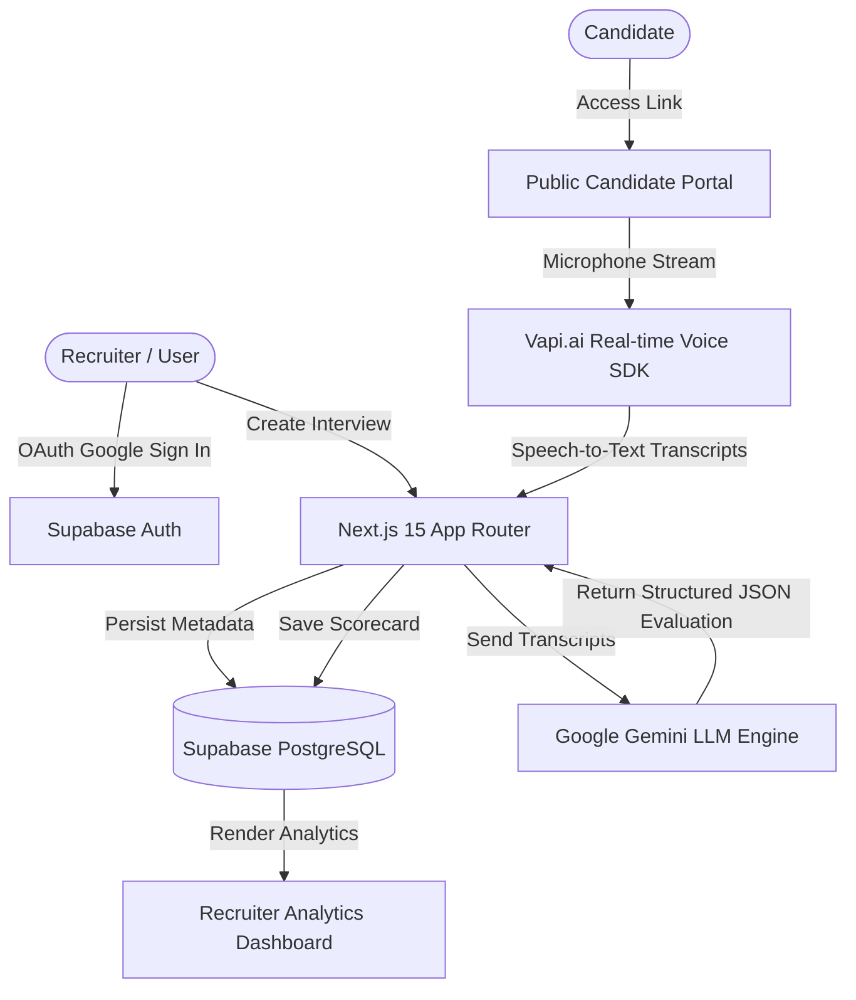

# 🎙️ AI Recruiter: Autonomous Voice Interviewer & Screening Platform

[](https://interviewerr.vercel.app/)
[](https://github.com/himanshu561hi/60-day-claude-challenge/tree/main/ai-recruiter)
[](https://github.com/himanshu561hi/60-day-claude-challenge/releases/tag/v1.0.0)
[](https://nextjs.org/)
[](https://supabase.com/)
[](https://vapi.ai/)
[](https://ai.google.dev/)

---

## 🌟 Executive Overview

**AI Recruiter** is a full-stack, voice-first autonomous hiring platform designed to revolutionize initial candidate screening. Powered by **Next.js 15**, **Vapi.ai Real-Time Voice Web SDK**, **Google Gemini AI**, and **Supabase (PostgreSQL + RLS)**, the platform enables recruiters to create customized voice interview templates in under 60 seconds and conduct hands-free, conversational voice interviews with candidates globally.

Upon interview completion, candidate audio transcripts are analyzed asynchronously by Google Gemini AI, producing structured, multi-dimensional feedback scorecards featuring overall ratings (1-10), technical competency breakdown, communication scores, key strengths, areas for improvement, and automated hiring recommendations.

---

## 🚀 Key Features

* **⚡ Recruiter Campaign Dashboard:** Sleek, glassmorphism UI to configure, manage, and monitor job interview pipelines.
* **🎯 60-Second Interview Creator:** Multi-step wizard customizing job position, target tech stack, experience tier, interview duration, and custom questions.
* **🌐 Public Candidate Interview Portals:** Dynamic candidate onboarding routes (`/interview/[interview_Id]`) with audio permission verification.
* **🗣️ Real-Time Voice Conversation Engine:** Sub-500ms voice turn-taking powered by Vapi.ai SDK, featuring real-time audio waveform visualizers.
* **🤖 Gemini AI Structured Evaluation Engine:** Automatic transcript analysis generating quantitative scorecards and qualitative recruiter summaries in strict JSON mode.
* **📊 Candidate Feedback Analytics:** Recruiter inspection dialog displaying color-coded scores, structured feedback metrics, and complete line-by-line dialogue logs.
* **🔒 Enterprise Security & RLS:** Granular Supabase Row Level Security policies guaranteeing strict user data isolation and safe public candidate submissions.

---

## 📐 System Architecture



---

## 🛠️ Technology Stack

| Component | Technology | Description |
| :--- | :--- | :--- |
| **Framework** | Next.js 15 (App Router) | Server-side rendering, API routes, layout groups |
| **Language** | JavaScript (ES6+ / React 19) | Modern component architecture |
| **Styling** | Tailwind CSS v4 | Dark glassmorphism, responsive grid layouts |
| **Components** | Radix UI / Lucide React | Accessible UI primitives & sleek iconography |
| **Voice Engine** | Vapi.ai Web SDK (`@vapi-ai/web`) | Sub-500ms voice streaming & speech recognition |
| **AI LLM Engine** | Google Gemini API (`@google/generative-ai`) | Dynamic transcript evaluation & schema scoring |
| **Database & Auth**| Supabase | PostgreSQL database, Row Level Security, Google OAuth |
| **Deployment** | Vercel | Global edge network & continuous integration |

---

## ⚙️ Environment Variables Setup

Create a `.env.local` file in the project root based on `.env.local.example`:

```env
# Supabase Configuration
NEXT_PUBLIC_SUPABASE_URL=https://your-project.supabase.co
NEXT_PUBLIC_SUPABASE_ANON_KEY=your-supabase-anon-key
SUPABASE_SERVICE_ROLE_KEY=your-supabase-service-role-key

# Google Gemini AI
GEMINI_API_KEY=your-gemini-api-key

# Vapi Voice Engine
NEXT_PUBLIC_VAPI_PUBLIC_KEY=your-vapi-public-key
VAPI_WEBHOOK_SECRET=your-vapi-webhook-secret

# Application URL
NEXT_PUBLIC_APP_URL=https://interviewerr.vercel.app
```

---

## 📦 Quick Start & Local Setup

```bash
# 1. Clone the repository
git clone https://github.com/himanshu561hi/60-day-claude-challenge.git

# 2. Navigate to the project folder
cd 60-day-claude-challenge/ai-recruiter

# 3. Install dependencies
npm install

# 4. Start local development server
npm run dev

# 5. Open browser at http://localhost:3000
```

---

## 🗄️ Database Migration SQL Script

Run the following SQL snippet inside your Supabase SQL Editor:

```sql
-- Create Profiles Table
CREATE TABLE profiles (
  id UUID PRIMARY KEY REFERENCES auth.users(id) ON DELETE CASCADE,
  email TEXT NOT NULL,
  name TEXT,
  picture TEXT,
  created_at TIMESTAMP WITH TIME ZONE DEFAULT timezone('utc'::text, now()) NOT NULL
);

-- Create Interviews Table
CREATE TABLE interviews (
  id UUID PRIMARY KEY DEFAULT gen_random_uuid(),
  recruiter_id UUID REFERENCES profiles(id) ON DELETE CASCADE NOT NULL,
  position_title TEXT NOT NULL,
  tech_stack TEXT NOT NULL,
  experience_level TEXT NOT NULL,
  duration INT NOT NULL,
  questions JSONB NOT NULL,
  created_at TIMESTAMP WITH TIME ZONE DEFAULT timezone('utc'::text, now()) NOT NULL
);

-- Create Candidate Submissions Table
CREATE TABLE candidate_submissions (
  id UUID PRIMARY KEY DEFAULT gen_random_uuid(),
  interview_id UUID REFERENCES interviews(id) ON DELETE CASCADE NOT NULL,
  candidate_name TEXT NOT NULL,
  candidate_email TEXT NOT NULL,
  transcript JSONB NOT NULL,
  feedback JSONB,
  overall_score INT,
  status TEXT DEFAULT 'completed',
  created_at TIMESTAMP WITH TIME ZONE DEFAULT timezone('utc'::text, now()) NOT NULL
);

-- Row Level Security (RLS)
ALTER TABLE profiles ENABLE ROW LEVEL SECURITY;
ALTER TABLE interviews ENABLE ROW LEVEL SECURITY;
ALTER TABLE candidate_submissions ENABLE ROW LEVEL SECURITY;

CREATE POLICY "Allow recruiters to view/edit own interviews" ON interviews
  FOR ALL USING (auth.uid() = recruiter_id);

CREATE POLICY "Allow public insert on candidate_submissions" ON candidate_submissions
  FOR INSERT WITH CHECK (true);

CREATE POLICY "Allow recruiters to read submissions for their interviews" ON candidate_submissions
  FOR SELECT USING (
    EXISTS (
      SELECT 1 FROM interviews 
      WHERE interviews.id = candidate_submissions.interview_id 
      AND interviews.recruiter_id = auth.uid()
    )
  );
```

---

## 📄 License & Attribution

Developed by **Himanshu Gupta** as the Capstone Sprint of the **AB Talks 60-Day Claude AI Challenge**. Co-created with **Claude AI (Free Tier)**.

*Website:* [abtalks.in](https://www.abtalks.in/) | *LinkedIn:* [AB Talks on AI](https://www.linkedin.com/company/abtalks-on-ai/)
